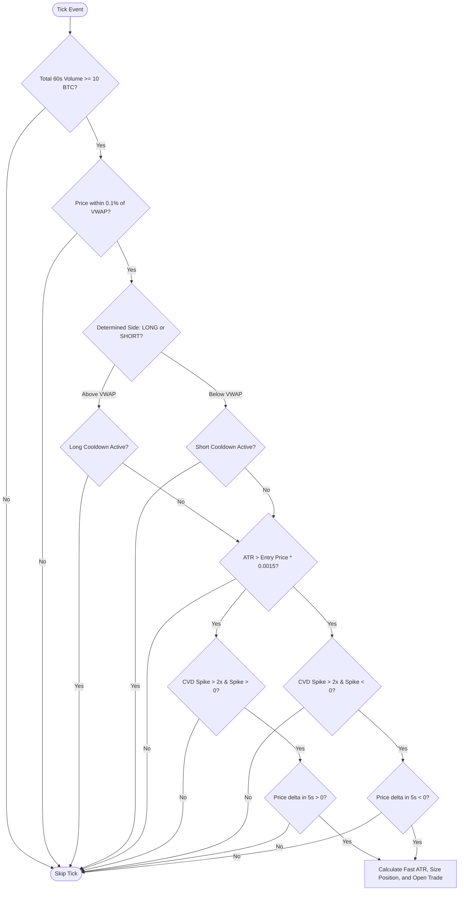
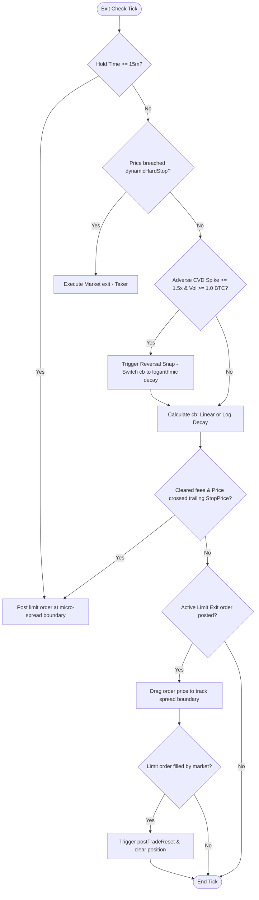

# Hyperbot V5.01 Entry & Exit Logic Breakdown

This document provides a detailed technical breakdown of the **V5.01 Time-Decay Yield Scalping** strategy. V5.01 transitions from survival paper trading to yield optimization by implementing maker rebate capture, volatility-gated entries, and dynamic momentum snaps.

---

## 1. Entry Logic Matrix (Volatility Gated)

V5.01 implements an additional filter, the **ATR Volatility Hurdle**, to prevent entries in low-volatility conditions that cannot cover the round-trip fee structure.

### The ATR Volatility Hurdle
Before evaluating order flow spikes, the bot cross-references the 1m 14-period ATR:
$$\text{ATR}_{\text{indicators}} > \text{Price} \times 0.15\% \quad (0.0015)$$
If volatility is lower than $0.15\%$ of the asset price, the setup is ignored. This ensures the market is active enough to cover execution costs.

---

## 2. Exit Logic Matrix & Shadow Limits

Standard exits (Time-Decay Exits and 15-minute Kill Switch) are moved from taker market orders to **maker limit orders** to secure execution rebates.

### Step 2.1: The Trailing Shadow Limit (Maker Exits)
To capture maker rebates ($0.015\%$ fee instead of $0.035\%$ taker fee), exits are processed as follows:
1.  When a trailing stop or 15-minute timeout triggers, the bot calls [postLimitExit](file:///home/azoroth/hyperbot/hyperBot/engine.js#L77) rather than submitting a market order.
2.  The matching engine posts a **Post-Only Limit Order** at the micro-spread boundary:
    *   **LONG Exit (Sell Limit)**: Placed at the Best Ask (`asks[0].px`).
    *   **SHORT Exit (Buy Limit)**: Placed at the Best Bid (`bids[0].px`).
3.  On every subsequent tick, the bot runs `updateLimitExit` to drag the order price against the current price to track the spread boundary.
4.  Once the spread crosses our order price, the limit is filled at the maker fee rate ($0.00015$).

### Step 2.2: The Momentum Reversal Snap (Logarithmic Decay)
To defend against sudden momentum shifts before they wipe out paper profits, the bot monitors the 5-second CVD trade spike:
*   **Trigger**: An adverse spike occurs (e.g. market buying while holding a SHORT, or selling while LONG) that exceeds **$1.5\times$ the baseline rate** and contains **$\ge 1.0 \text{ BTC}$** of volume.
*   **The Snap**: The trailing stop abandons the linear decay path. It immediately snaps the stop price closer using a steep **logarithmic decay** curve based on time since the snap ($T_{\text{snap}}$ in ms):
    $$cb = \frac{\text{initStop}}{1 + \ln(1 + T_{\text{snap}}/1000)}$$
    This decays the callback rate ($cb$) to the $0.02\%$ floor within seconds, choking out the trade immediately to preserve capital.

---

## 3. The Post-Trade Reality Reset

To prevent execution delays and avoid trading on obsolete data, V5.01 implements a post-trade refresh cycle:
1.  **Trigger**: The millisecond a position is closed or flipped in [state.js](file:///home/azoroth/hyperbot/hyperBot/state.js#L71).
2.  **Trade Buffer Flush**: Calls `flushTradeBuffer()` in `feed.js` to immediately clear the historical `tradeBuffer` of trade ticks. This wipes the CVD and volume statistics clean so the next entry is not triggered by "ghost" volume from the trade that just closed.
3.  **Position Size Recalibration**: Position sizing is dynamically recalculated on the next tick based on the newly updated account equity.
4.  **Indicator Refresh**: Triggers an immediate `refreshIndicators()` call in `index.js` to recalculate SMA, RSI, and ATR targets without waiting for the 5-minute timer.
