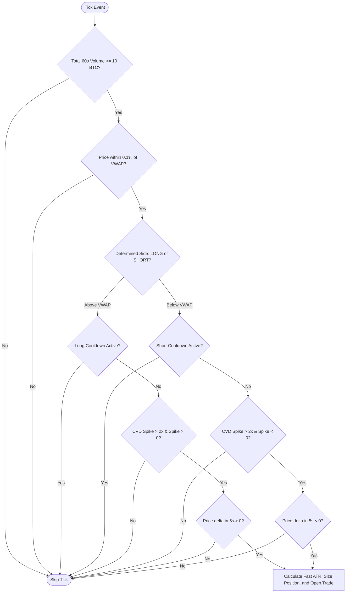

# Hyperbot V5.0 Entry & Exit Logic Breakdown

This document provides a detailed technical explanation of the **V5.0 Time-Decay Order Flow Scalping** strategy. The strategy combines order flow signals (VWAP and CVD) with a time-decaying exit engine to prevent capital bleed in flat or failing trades.

---

## 1. Entry Logic Matrix

Before checking signals, the bot filters market conditions to ensure sufficient market activity and avoid choppy ranges.



### Step 1.1: Volume Filter Gating
On every tick, the bot queries the data feed via [hasMinVolume](file:///home/azoroth/hyperbot/hyperBot/feed.js#L305):
$$\text{Total Volume}_{\text{60s}} = \text{Buy Volume}_{\text{60s}} + \text{Sell Volume}_{\text{60s}} \ge 10.0 \text{ BTC}$$
If total volume is less than 10 BTC, entry checking is skipped. This prevents entry triggers from firing into illiquid spreads.

### Step 1.2: VWAP Proximity Lock
The bot matches price relative to the daily volume-weighted average price ([vwapState.vwap](file:///home/azoroth/hyperbot/hyperBot/feed.js#L21)):
$$\text{Distance} = \frac{|\text{Price} - \text{VWAP}|}{\text{VWAP}} \le 0.1\% \quad (0.001)$$
*   **LONG Gate**: If price is above VWAP (within 0.1%), we only search for Buy setups (Bounce).
*   **SHORT Gate**: If price is below VWAP (within 0.1%), we only search for Sell setups (Rejection).

### Step 1.3: CVD Spike Confluence
The bot analyzes the immediate order flow over the last 5 seconds.
1.  **Baseline Rate**: Calculates the average absolute CVD delta per second over 60 seconds.
2.  **Spike Ratio**: Calculates the 5-second CVD rate relative to the baseline:
    $$\text{Spike Ratio} = \frac{|\text{CVD}_{\text{5s}}| / 5}{\text{Baseline Rate}}$$
    The spike must be at least **$2\times$ the baseline rate** ($2.0$) and align with the trend side:
    *   **LONG**: `CVD_5s > 0` (Aggressive market buying)
    *   **SHORT**: `CVD_5s < 0` (Aggressive market selling)

### Step 1.4: Momentum Validation
To prevent catching falling knives, the bot checks the price change over the 5-second CVD window:
*   **LONG**: Price must be higher now than it was 5 seconds ago (`priceDelta > 0`).
*   **SHORT**: Price must be lower now than it was 5 seconds ago (`priceDelta < 0`).

### Step 1.5: Volatility-Adjusted Initial Stop Setting
Upon entering, a **fast 14-period ATR** is computed over the last hour (60 minutes of 1m candles). The initial trailing stop callback ($0.15\%$) is scaled dynamically by the ratio of this fast ATR to a baseline relative ATR ($0.05\%$):
$$\text{Adjusted Stop Pct} = 0.15\% \times \frac{\text{Fast ATR} / \text{Price}}{0.05\%}$$
This adjusted stop is clamped between $0.02\%$ and $0.50\%$ and set as the initial trailing stop callback.

---

## 2. Exit Logic Matrix

Once a position is opened, the exit engine runs on every tick. The exit logic consists of a hard stop, a time switch, and a dynamic fee-sensitive trailing stop.

> [!IMPORTANT]
> The trailing stop is **active immediately** upon entry, but its movement is frozen until a mathematically verified taker fee threshold is crossed.

### Step 2.1: The 15-Minute Hard Kill Switch
If the elapsed hold time is $\ge 15 \text{ minutes}$ ($900,000 \text{ ms}$), the trade is forcefully closed at market, regardless of profit or loss, to free up capital and prevent stagnation.

### Step 2.2: Hard Stop-Loss
Initial hard stop-loss is set on entry using standard ATR:
$$\text{Hard Stop} = \text{EntryPrice} \pm 1.5 \times \text{ATR}_{\text{indicators}}$$
If price breaches this level, the position is closed at market, and a 5-minute global cooldown is activated for both sides to prevent revenge trading.

### Step 2.3: Taker Fee-Adjusted Break-Even Lock
To ensure taker execution fees do not eat into nominal profits, the trailing stop is **not allowed to adjust or trail** until the market price clears the taker fee break-even price. The taker fee rate is **$0.035\%$** ($0.00035$).

The mathematical break-even prices are calculated in [MatchingEngine](file:///home/azoroth/hyperbot/hyperBot/engine.js#L2):

$$\text{Break-Even Price}_{\text{LONG}} = \text{EntryPrice} \times \frac{1 + 0.00035}{1 - 0.00035} \approx \text{Entry} \times 1.0007$$

$$\text{Break-Even Price}_{\text{SHORT}} = \text{EntryPrice} \times \frac{1 - 0.00035}{1 + 0.00035} \approx \text{Entry} \times 0.9993$$

*   Until the price crosses this break-even threshold, the trailing stop remains locked at its entry location.
*   If the trade closes without ever clearing this line, it is flagged as a **fee-adjusted threshold failure** in `trade_ledger.jsonl`.

### Step 2.4: Time-Decay Callback Function
As elapsed time goes from 1 minute to 10 minutes, the trailing stop callback rate ($cb$) decays linearly from the volatility-adjusted initial stop ($\text{initStop}$, typically around $0.15\%$) down to a tight floor of **$0.02\%$**:

```
Trailing Callback Rate (cb)
 ^
 |  [initStop] (e.g. 0.15%)
 |     \
 |      \  Linear decay
 |       \
 |        \-------> [0.02%] (choked tight callback)
 |
 +-----+---+-------+------> Time (Minutes)
      M0  M1      M10
```

The callback decay rate $cb$ is calculated as:
*   **$T \le 1\text{m}$ ($60,000\text{ ms}$)**:
    $$cb = \text{initStop}$$
*   **$1\text{m} < T < 10\text{m}$ ($60,000\text{ ms}$ to $600,000\text{ ms}$)**:
    $$cb = \text{initStop} - \frac{T - 60,000}{600,000 - 60,000} \times (\text{initStop} - 0.0002)$$
*   **$T \ge 10\text{m}$ ($600,000\text{ ms}$)**:
    $$cb = 0.02\% \quad (0.0002)$$

### Step 2.5: Dynamic Trailing Stop Execution
Once taker fees are cleared, the trailing stop adjusts:
*   **LONG**:
    If $\text{Price} > \text{HighWaterMark}$, update $\text{HighWaterMark} = \text{Price}$.
    $$\text{StopPrice} = \max(\text{StopPrice}, \text{HighWaterMark} \times (1 - cb))$$
*   **SHORT**:
    If $\text{Price} < \text{HighWaterMark}$, update $\text{HighWaterMark} = \text{Price}$.
    $$\text{StopPrice} = \min(\text{StopPrice}, \text{HighWaterMark} \times (1 + cb))$$

As time elapsed ($T$) increases, $cb$ decreases (choking down). This causes the stop price to move closer to the high water mark even if price stagnates, suffocating the position and forcing an exit. If price crosses $\text{StopPrice}$, the trade exits immediately at market.
