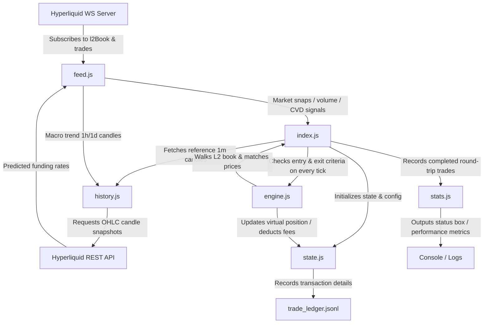

# Hyperbot Project Architecture Overview

Hyperbot is a simulated (paper trading) cryptocurrency scalping bot designed for the Hyperliquid perpetual swaps market (primarily targeting BTC). It subscribes to real-time Level 2 order books and trade streams to model latency, slippage, trade execution, and risk metrics locally without risking real capital.

---

## Component Interaction Flow

The diagram below details how data flows from the Hyperliquid API through the bot modules to execute simulated trades and update the local ledger.

---

## File Summary and Functionality

The following table summarizes the purpose of each JavaScript file in the workspace, highlighting key classes, functions, and roles.

| File Path | Primary Class / Functions | Description & System Role |
| :--- | :--- | :--- |
| [index.js](file:///home/azoroth/hyperbot/hyperBot/index.js) | `startBot`, `checkVWAPEntry`, `checkMicroSqueezeExit`, `calculatePositionSize` | **Main orchestrator.** Configures trading parameters (equity floor, risk %, leverage caps, triggers), instantiates the virtual state, feed, matcher, and stats tracker. Runs the main loop on every order book tick. |
| [feed.js](file:///home/azoroth/hyperbot/hyperBot/feed.js) | [startFeed](file:///home/azoroth/hyperbot/hyperBot/feed.js#L82), [refreshMacroTrend](file:///home/azoroth/hyperbot/hyperBot/feed.js#L33), `getCVDSpike`, `getVWAP` | **Market data pipeline.** Subscribes to Hyperliquid L1 WebSockets (`l2Book` and `trades`), calculates real-time Volume Weighted Average Price (VWAP) and Cumulative Volume Delta (CVD) metrics, and fetches predicted hourly funding rates. |
| [state.js](file:///home/azoroth/hyperbot/hyperBot/state.js) | [VirtualState](file:///home/azoroth/hyperbot/hyperBot/state.js#L3), [updatePosition](file:///home/azoroth/hyperbot/hyperBot/state.js#L71), [isHalted](file:///home/azoroth/hyperbot/hyperBot/state.js#L55) | **Virtual ledger.** Manages the virtual balance (USDC), position metrics (sizes, entry prices), cooldowns, and risk halts (daily drawdowns and equity floor checks). Appends transaction logs to the JSONL ledger. |
| [engine.js](file:///home/azoroth/hyperbot/hyperBot/engine.js) | [MatchingEngine](file:///home/azoroth/hyperbot/hyperBot/engine.js#L2), [executeMarketOrder](file:///home/azoroth/hyperbot/hyperBot/engine.js#L7) | **Virtual execution matcher.** Simulates market orders by traversing asks/bids in the order book snapshot to calculate filled prices and execution slippage penalties. |
| [history.js](file:///home/azoroth/hyperbot/hyperBot/history.js) | [fetchHistoricalOHLC](file:///home/azoroth/hyperbot/hyperBot/history.js#L17), `fetchHourlyCandles` | **Historical OHLC API client.** Sends HTTP POST requests to fetch historical candlestick snapshots from the Hyperliquid API `/info` endpoint. Used to calculate indicators (RSI, ATR, SMA). |
| [stats.js](file:///home/azoroth/hyperbot/hyperBot/stats.js) | [PerformanceTracker](file:///home/azoroth/hyperbot/hyperBot/stats.js#L4), [printQuickSummary](file:///home/azoroth/hyperbot/hyperBot/stats.js#L127), [printReport](file:///home/azoroth/hyperbot/hyperBot/stats.js#L200) | **Analytics engine.** Tracks completed trades to calculate win rate, profit factor, annualised Sharpe ratio, and Sortino ratio (downside deviation). Prints periodic status lines and final reports. |
| [ratelimit.js](file:///home/azoroth/hyperbot/hyperBot/ratelimit.js) | [RateLimiter](file:///home/azoroth/hyperbot/hyperBot/ratelimit.js#L6) | **Token bucket utility.** Implements Hyperliquid API rate limit tracking (100 max tokens, 10 refilling per second). Currently unused in paper trading mode. |

---

## Standalone Test & Experimental Files

These files are prototype scripts used for testing specific parts of the WebSocket API and feed architectures prior to unified integration:

*   **[feed2.js](file:///home/azoroth/hyperbot/hyperBot/feed2.js)**: A lightweight test harness to connect to Hyperliquid's WS pipeline, subscribe to BTC L2 books, and continuously log bid/ask spreads.
*   **[hyper.js](file:///home/azoroth/hyperbot/hyperBot/hyper.js)**: A basic trade feed aggregator prototype. It processes BTC trade events to compute sell-to-buy ratios and test sell-exhaustion alerts (a precursor to the CVD/VWAP indicator setup).

---

## Documentation and Iteration Plans

The project contains several outlines tracking the evolution of the trading strategies:

1.  **[idea.txt](file:///home/azoroth/hyperbot/hyperBot/idea.txt)**: Tracks missing features in the simulation logic (such as dynamic position sizing, secure `.env` key storage, and rolling Sharpe/Sortino calculations) and prioritizes next steps.
2.  **[outlinev1.txt](file:///home/azoroth/hyperbot/hyperBot/outlinev1.txt)**: Architecture details of the initial mock exchange concept, simulating exchange rules, tick/lot size constraints, and order-book ingestion.
3.  **[outlinev2.txt](file:///home/azoroth/hyperbot/hyperBot/outlinev2.txt)**: Development rules for production hardening (exponential backoff reconnect loops, AWS Tokyo VPS setups, ATR volatility stops, and profit reinvestment structures).
4.  **[oulinev3.txt](file:///home/azoroth/hyperbot/hyperBot/oulinev3.txt)** *(spelled `oulinev3.txt`)*: Details the Chrono-Squeeze strategy (duration-based stops narrowing trailing callback limits over time) and funding-intercept yield optimization rules.
5.  **[outlinev4.txt](file:///home/azoroth/hyperbot/hyperBot/outlinev4.txt)**: Specs for the previous V4 strategy (VWAP direction lock + CVD order flow triggers + tight Micro-Squeeze exits) and drafts a prompt for integration with a Gemini API decision oracle ("Yumi").
6.  **[outlinev5.txt](file:///home/azoroth/hyperbot/hyperBot/outlinev5.txt)**: Specs for the previous V5 strategy (Linear time-decay trailing stop + 15m hard kill switch + 0.035% taker fee break-even filter + minimum volume threshold).
7.  **[outlinev5.01.txt](file:///home/azoroth/hyperbot/hyperBot/outlinev5.01.txt)**: Specs for the current V5.01 strategy (Linear-to-logarithmic time-decay + post-trade resets + fast ATR volatility hurdle + Trailing Shadow Limit maker executions).
8.  **[strategy_logic_v5.md](file:///home/azoroth/hyperbot/hyperBot/strategy_logic_v5.md)** / **[strategy_logic_v5.01.md](file:///home/azoroth/hyperbot/hyperBot/strategy_logic_v5.01.md)**: Mathematical logic blueprints detailing setup parameters, entry checkpoints, fee-clearing, and exit snap decays.

---

## Local Data Storage

*   **[trade_ledger.jsonl](file:///home/azoroth/hyperbot/hyperBot/trade_ledger.jsonl)**: A continuous log of simulated execution events. Each entry records the timestamp, side (BUY/SELL), size, execution price, commission fee, realized PnL, post-trade balance, and entry/exit reason details.
